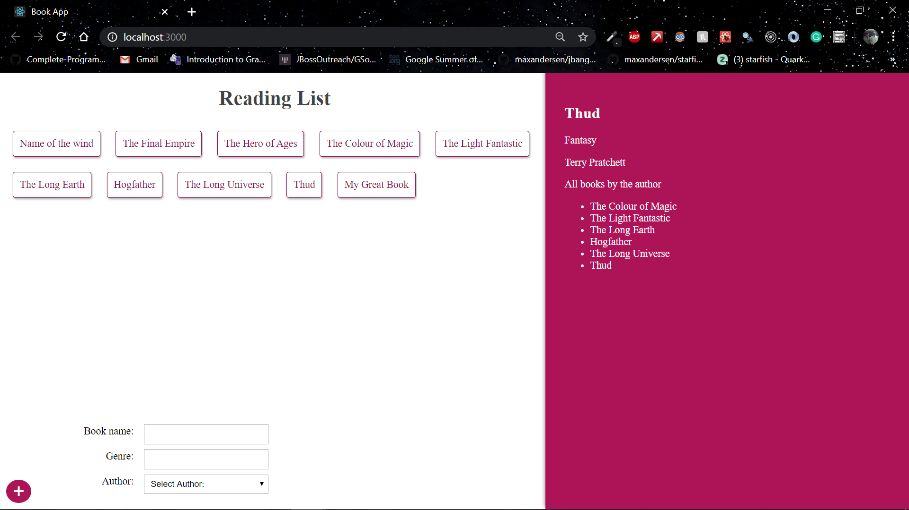

# Book-App
A GraphQL app

### Index
- Content
- Usage
- Screenshots
- Technologies Used
- Authors

## Content
This is a book app where a list of books are displayed and on clicking one of the book, the genre of the book, the author of the book and the different books written by the author are displayed.
The user can also add a book by spcifying the name, the genre and by selecting the author from the list.

## Usage
1. Clone the repo using the command `git clone https://github.com/AtharvaThorve/GraphQL-Test.git`
2. Enter the directory by executing the command `cd GraphQL-Test` on the command prompt.
##### Server Setup
1. Enter the directory by using the command `cd server`.
2. Run the command `npm install` to install required dependencies.
3. Run the command `npm start` to start the server on localhost:4000

##### Client Setup
1. Exit the server directory by the command `cd ..`
2. Enter the directory client with the command `cd client`.
3. Run the command `npm install` to install required dependencies.
4. Run the command `npm start` to start the app on localhost:3000

## Screenshots
Screenshot of the final app.   
   

## Technologies used:
- For FrontEnd:
  - React
  - Apollo client
- Server Side:
  - NodeJS
  - ExpressJS
  - GraphQL
  - Mongoose framework
- Database:
  - MongoDB Atlas
 
 ## Authors
 [Atharva Thorve](https://github.com/AtharvaThorve)

